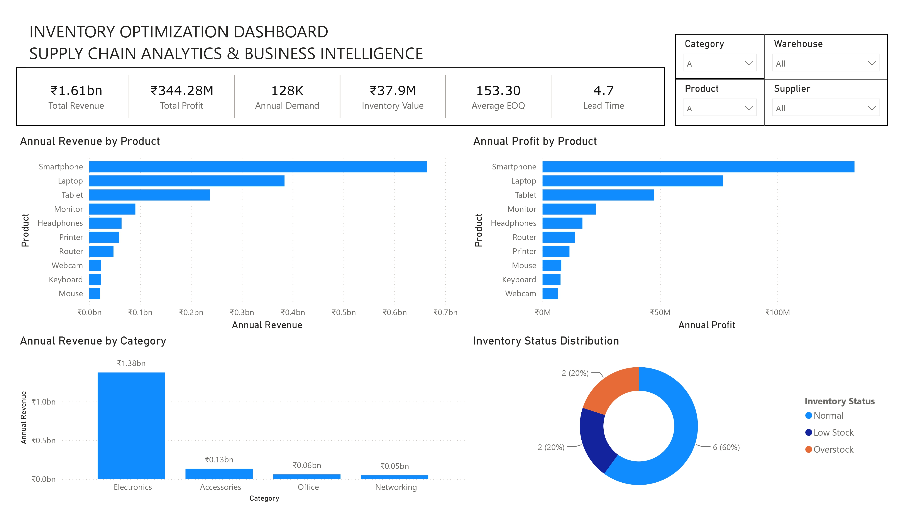
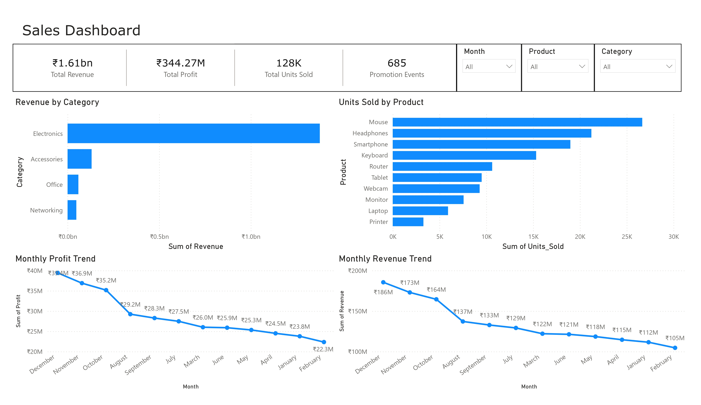
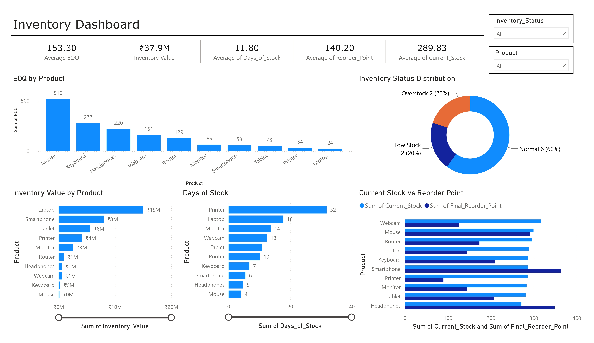
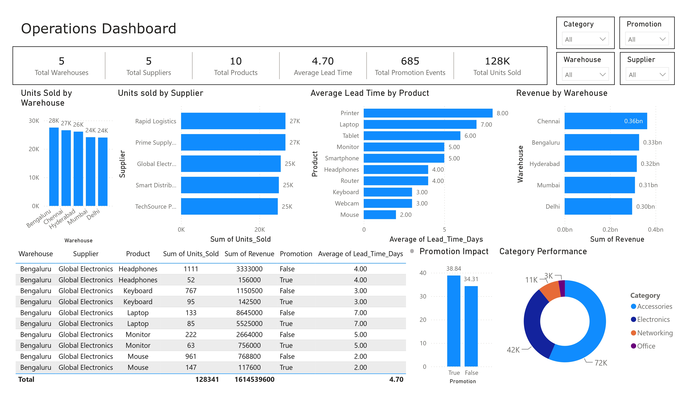

# 📦 Supply Chain Analytics & Inventory Optimization

An end-to-end Supply Chain Analytics project that demonstrates data generation, demand forecasting, inventory optimization, SQL analysis, and interactive Power BI dashboards.

---

## 📌 Project Overview

This project simulates the operations of a retail supply chain by generating a synthetic inventory dataset and performing comprehensive business analysis.

The project covers the complete analytics workflow:

- Data Generation using Python
- Demand Forecasting with Machine Learning
- Inventory Optimization using EOQ, Safety Stock, and Reorder Point
- SQL Analysis using SQLite
- Interactive Power BI Dashboards

---

## 🚀 Tech Stack

- Python
- Pandas
- NumPy
- Scikit-learn
- SQLite
- SQL
- Power BI
- Matplotlib

---

## 📂 Project Structure

```
inventory-optimization-project/
│
├── dashboards/
├── data/
│   ├── raw/
│   └── processed/
├── models/
├── notebooks/
├── reports/
├── src/
├── inventory.db
├── requirements.txt
└── README.md
```

---

## 🔄 Project Workflow

Synthetic Data Generation
        ↓
Data Cleaning & Processing
        ↓
Demand Forecasting
        ↓
Inventory Optimization
        ↓
SQLite Database
        ↓
SQL Business Analysis
        ↓
Power BI Dashboards

---

## 📊 Dashboards

## 📊 Dashboard Preview

### Executive Dashboard



---

### Sales Dashboard



---

### Inventory Dashboard



---

### Operations Dashboard



The project contains four interactive dashboards:

### Executive Dashboard

- Revenue KPI
- Profit KPI
- Inventory Value
- Demand Summary
- Revenue by Category
- Profit by Product

### Sales Dashboard

- Monthly Revenue Trend
- Monthly Profit Trend
- Units Sold by Product
- Revenue by Category
- Promotion Analysis

### Inventory Dashboard

- EOQ Analysis
- Reorder Point
- Inventory Value
- Days of Stock
- Inventory Status Distribution

### Operations Dashboard

- Warehouse Performance
- Supplier Performance
- Promotion Impact
- Lead Time Analysis
- Category Performance

---

## 📈 Machine Learning

### Demand Forecasting

Model Used:

- Linear Regression
- Random Forest Regressor

Evaluation Metrics

- Mean Absolute Error (MAE)
- Root Mean Squared Error (RMSE)
- R² Score

---

## 📦 Inventory Optimization

Implemented:

- Economic Order Quantity (EOQ)
- Safety Stock
- Reorder Point
- Recommended Order Quantity
- Inventory Status Classification

---

## 🗄 SQL Analysis

Business queries include:

- Top Selling Products
- Revenue by Product
- Profit by Product
- Warehouse Performance
- Supplier Performance
- Category Performance
- Promotion Impact
- Monthly Sales Trend
- Inventory Value

---

## 💡 Key Business Insights

- Electronics generate the highest revenue.
- Accessories contribute the highest unit sales.
- Promotions increase average daily sales.
- EOQ helps optimize replenishment quantities.
- Inventory status highlights products requiring replenishment.

---

## ▶️ How to Run

Clone the repository

```bash
git clone <repository-url>
```

Install dependencies

```bash
pip install -r requirements.txt
```

Generate the dataset

```bash
python src/generate_dataset.py
```

Run demand forecasting

```bash
python src/demand_forecasting.py
```

Run inventory optimization

```bash
python src/inventory_optimization.py
```

Create the SQLite database

```bash
python src/database_setup.py
```

Execute SQL analysis

```bash
python src/sql_analysis.py
```

Open the Power BI dashboard

```
dashboards/Supply_Chain_Analytics_Dashboard.pbix
```

---

## 🔮 Future Enhancements

- Real-time API integration
- Demand forecasting using XGBoost
- Automated inventory alerts
- Power BI Service deployment
- Interactive web dashboard using Streamlit

---

## 👤 Author

**Dinesh Attili**

MBA – Business Analytics & Operations
